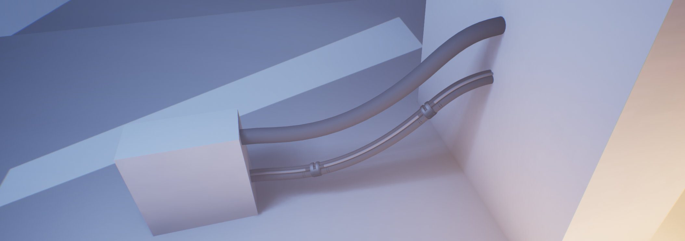

# Cable Actors

**Tether Cable Actors** are self-contained objects in the world that are responsible for handling all of the functionality for a single cable, including settings, physics simulation, mesh generation, and the resultant static mesh.

The overall path of the cable before simulation is determined by a **Spline Component** on the Actor, which may have already been set up using the [Cable Placement Mode](editor-mode.md)

## Physics Simulation

Tether runs an asynchronous physics simulation for the cable, simulating for a certain amount of time and skipping ahead to the final result so that you don't need to wait for it.
When the cable path or any applicable properties are modified, the simulation is run again automatically so that the cable stays up to date.

## Mesh Generation

Once the physics simulation is complete, Tether generates a mesh for the cable using one of two methods which the user can specify per-cable:

### Basic Mesh Generation

This mode generates simple geometry for the cable using a specified number of sides and edge loop resolution.
Unncessary edge loops can be culled automatically based on the angle to optimize the final geometry.

### Custom Mesh Generation

This mode takes a user-specified Static Mesh asset and repeats it along the length of the cable, deforming it similar to how a Spline Mesh would.

The number of instances of the mesh to be repeated can be specified by the user, or calculated automatically based on the width and length of the cable and the source mesh.
Material IDs are also copied, allowing the use of the same number of materials as the source mesh.

The source mesh must be x axis aligned and have sufficient geometry to allow for proper deformation, just like with spline meshes. When simulating physics with collision with other objects, it's also recommended to keep the mesh as cylindrical as possible as the collision for the cable while it is simulating is approximate and does not factor in the shape of the mesh.

As the geometry is copied from the source mesh when the mesh is generated, any changes to the source mesh won't be reflected afterward unless the cable mesh is regenerated.

This mode is very powerful for creating more detailed cables, but has the potential to create very dense geometry if not used carefully.

