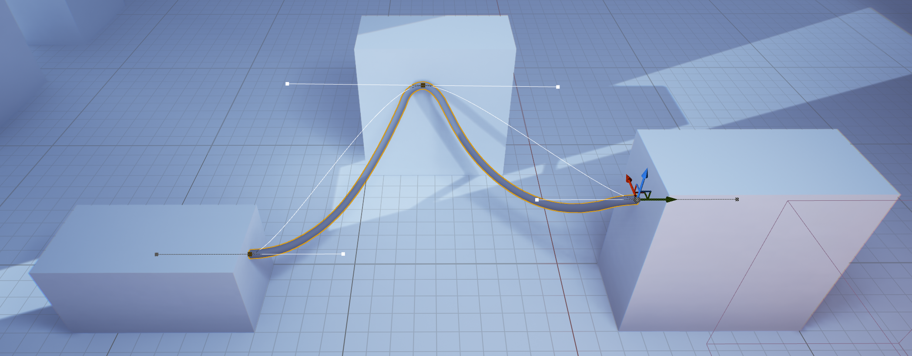
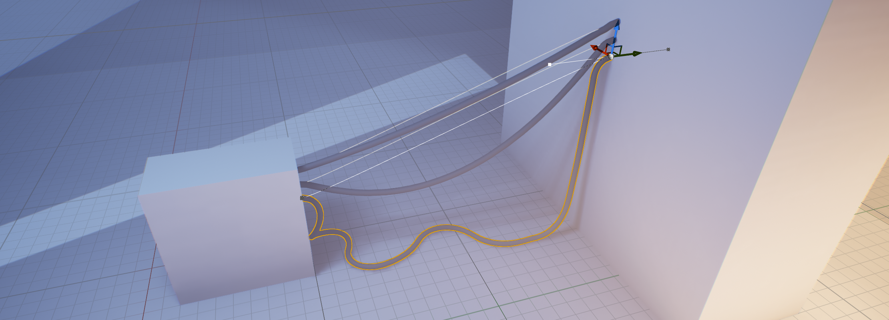
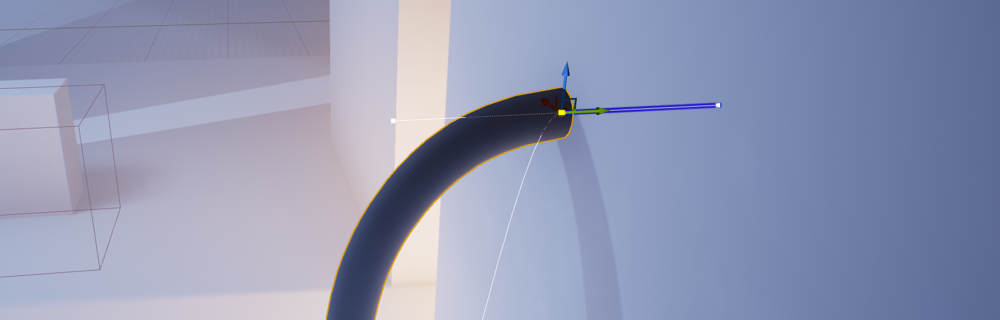

# Cable Placement Mode

The **Cable Placement Mode** allows easy placement of cables by clicking points in the world.

To activate the editor mode, use the Modes dropdown or the appropriate shortcut keys.

With the mode activated, the mode panel can be used to customize the properties of any new cables created from then on.

If **Auto Start Cable** is true, clicking in the viewport will start a new cable, otherwise **Start New Cable** must be clicked first.

## Cable Point Placement

When a new cable is started, a [Tether Cable Actor](cable-actors.md) is created and the first point will be placed in the world at the location that was clicked in the viewport.

To end the cable, click another location in the viewport to place the final point of the cable.

To create cables with multiple segments, instead shift-click a location to end the current segment and start a new one.

## Adjusting Slack

Slack can be adjusted for the current segment as part of the cable placement workflow by using the scroll-wheel before ending the segment.
The **ctrl** modifier can be held for more fine adjustment.

## Point Tangents
When placing a point, **click and drag** to specify the direction or tangent of the cable along the surface. Hold **alt** to align the tangent to the normal of the surface, which creates the appearance that the end of the cable is fixed to the surface.

