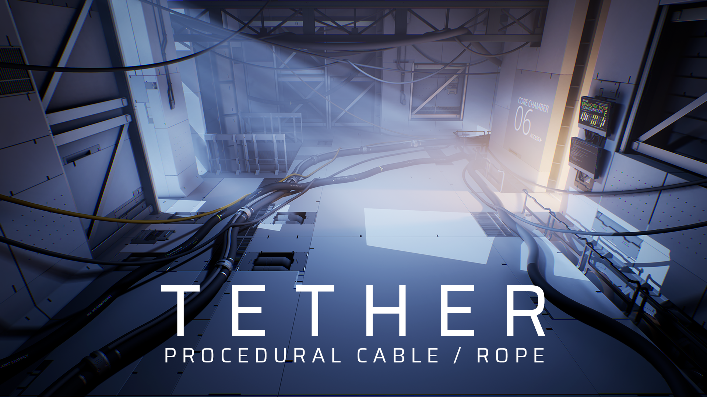

# Intro

**Tether** is a tool for creating cables, ropes, chains, flexible pipes, and other long bending objects, in the **Unreal Engine** editor, for environment art and set-dressing purposes.
Tether simulates physics and builds static meshes in-editor, allowing rapid creation and iteration of cables using a non-destructive workflow.

## Current Features

**Editor mode:**

- The **Tether editor mode** allows easy placement of cables by clicking points in the world.
- Adjust slack, set tangents, and chain multiple cable segments together as part of the cable creation workflow.

**Cable Actors:**

- **Tether Cable Actors** are self-contained objects in the world that handle all the functionality for a single cable, including settings, physics simulation, mesh generation, and the resultant static mesh.
- The overall path of the cable before simulation can be controlled using Unreal's spline tools.
- When modified, cables are automatically resimulated and rebuilt for the fastest possible iteration time.
- Simulation supports physics collision with other objects in the world, including other cables, allowing them to coil up on the ground and hang on eachother.
- The mesh for the cable can be generated procedurally using a specified resolution for the number of sides and edge loops, or use a user-specified mesh for full control of the final result.
- The generated static mesh is saved inside of the Actor in the world, removing the need for any asset management by the developer. The developer can still open it and modify the static mesh properties as usual.
- At runtime, all physics simulation and mesh generation functionality is stripped away leaving the final static mesh. There's no physics simulation slowing down the game at runtime, which allows areas in the game to have many more cables than if they were dynamically simulated.
- Optionally, sets of one or more cables can be saved as a static mesh asset to be reused across multiple places in a game.
